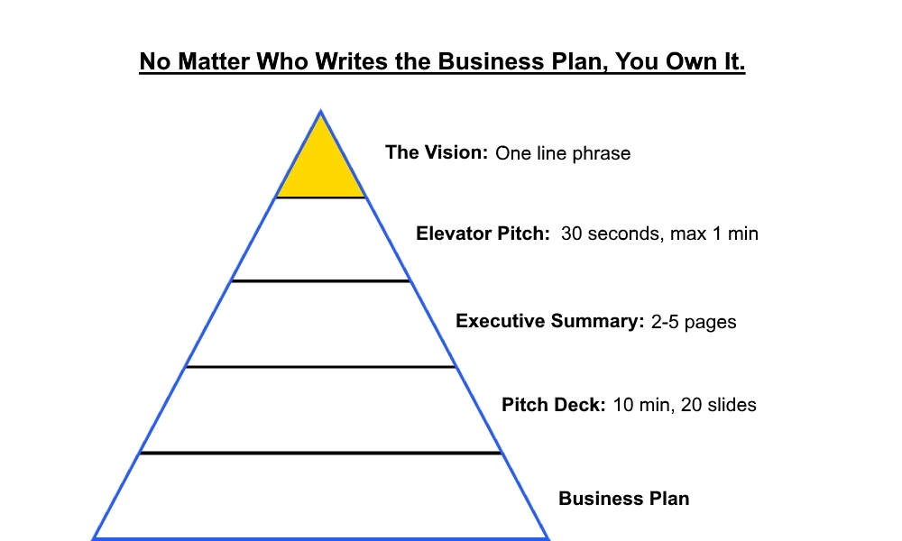
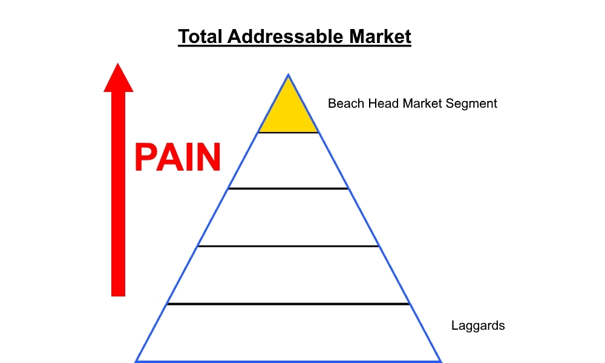
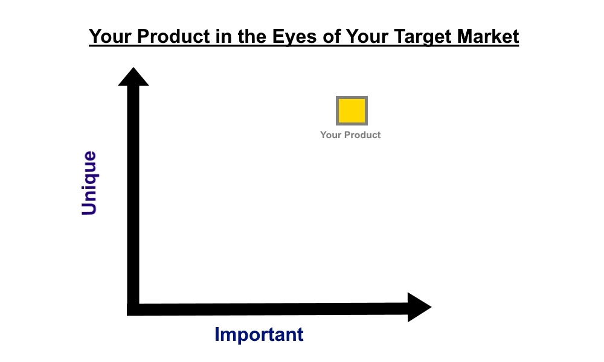

# On the Subject of New Ventures

I recently completed a course at MIT that offered practical guiding advice on the mechanics of creating a new business or venture. Appropriately named 'The Nuts and Bolts Of New Ventures', this course is offered once a year to MIT students and the surrounding community.

The professors and guest speakers, who are lecturers at Sloan School of Management and run the MIT 100k pitch competition, have seen their fair share of startup successes and failures. To that effect, the educational material being passed along in this course (in my opinion) is invaluable to anyone interested in pursuing a new venture.

This essay is my attempt to capture some of the information shared. The following sections are a more cohesive representation of the notes taken during the course. These notes are focused around the act of planning for a new venture and creating a business plan.

## Planning For a New Venture

As Dwight D Eisenhower said, "Plans are worthless, but planning is everything". Creating a business plan requires you to think critically about important aspects of your new venture and by doing so, helps clarify the direction of your venture.

To turn a venture in a sustainable business, you'll need to understand where your financial resources will be coming from, and how you will be collecting them. This requires both to understand your customer and the impact of your business from an economics view. Planning helps you formalize these thoughts, and a business plan is the result of this process.

## What you should tell Investors

You should have a good enough understanding of your venture to be able to explain it in one minute. Usually when you are pitching your venture, it's to potential investors.

By investors, we are talking about individuals or organizations who would offer their time, services or money to helping you realize your venture. In this pitch, try to clearly answer the following:

- What is the unmet need?
- Who is paying you?
- What are you looking for to make the venture happen?
- How are you making money?

To this effect, you want to be as grounded in your estimates as possible. Investors are more happy when the reality of the venture exceeds their expectations.

## Communicating your plan

The presentation of your venture will probably be delivered in many different formats. You should be able to communicate your venture effectively in each form.

## The Three Why's

Actually there are four why's that sit in the investors mind when they are looking at your business. When you find yourself in front of an investor, here are some of the thoughts that may run through their head:

- **Why This?** Why should I pay attention to your venture?
- **Why Now?** What timing in the trends make this a new opportunity?
- **Why You?** What makes you/your team so special for solving this?
- **Why Won't This Succeed?** What resources do you need to avoid failure?

## Executive Summary

The executive summary is arguably the first thing investors read when they look at your business plan. It's a 2-3 page that summarizes your venture and addresses the key questions on the investors mind. In this section you should address these points:

- Who are you?
- What is your strategy or vision?
- What are you doing?
- What is the market?
- What is the impact potential of the venture?
- What do you need?
- Describe your product, startup costs, payoffs
- **What is the sustainable competitive advantage?**

Investors would like to see a 30x return on their investment, so the size of your target market (in dollars), and the percentage of that market you hope to capture, should be large enough to provide the return on the investment you're requesting. Your venture should be creating value in a certain market and capturing a portion of the value of that market.

**You should be clearly creating value, and capturing a portion of it.**

## Market Plan

A Market plan should be an outward look on the segment of the population or industry you're targeting. An analysis should help you answer these questions:

- What are the trends, and what is the speed of these trends?
- How big can this get?
- What changes in the market make this the right time?
- What are the existing products? (How are customers currently solving the problem?)
- Who are the players?
- Who loses if you win, and what would be their response?
- What is your pricing, distribution, and sales tactics?

## Market Segment

A lot of customers may use your product for different reasons. Frankly, nobody cares about your product, they care about the benefits. These benefits can be different from person to person. For example. if you are selling a food item, some may want it for the flavor, some for the health benefits, some for the convenience.

Just to repeat an important point:

**Nobody cares about your product, they just need it's benefits**

When you are first starting your venture, you should target the market segment who is in the most pain. Whoever would benefit the most from your product or service should be the first customers you address. This is known as the beach head market.

You should be able to clearly identify a beach head market and understand how they are in pain. If you cannot build a product or service that addresses their needs, then forget about the remaining market. This beach head market should be a group of people who are in so much need for the benefits of your product or service that they are willing to try something they've never seen or heard of before. Acquiring them as customers gives you traction in your business, revenue and negotiating power. Proving that you have a growing customer base helps sell your venture to partners and investors.

**Products built for everyone aren't for anyone.**

## Development Plan

You should have a section in your business plan that covers your development plan. This talks about the current status of your product or service, how far along you are and how much more development is needed before it's ready for the customer. You should describe what is needed from a development standpoint to get your product or service market ready, as well as to make it competitive and defensible. Defensibility describes how easy it is for other business to replicate the service or product you offer.

One other thing to note is to avoid a development style or products that require the product to be fully built before it can offer any value. The product or service should be able to create value as early as possible, and a long time-line to get there is not very attractive.

## Action Plan

You should have clear direction on the next steps. Be able to answer what you will do and when. Here are some other questions to consider when crafting an action plan:

- Who are your credibility testers? Who doubts it will work?
- What is each segment of your business growth, and how are you creating value at each step?

A good case study of the second item is that of Netflix. They started as a company that would mail you movies that you would mail back instead of commuting to a store. They offered value in logistics. As the next stage of growth, they transitioned to a digital content provider, offering movies and TV shows via streaming online. Recently, they have transitioned to a content creator, providing value by hiring actors, directors and producers to create shows and movies. At each stage of growth they changed how they are creating value.

- Who and what are you dependent on? Try to eliminate these.
- What is the coordination of events, promotions, value recognition?
- What are your financial requirements to support this?

## When Reading Business Plans

With all these points in mind, now is the time to craft the business plan. Here are some pointers and reminders of things you want to avoid when writing out your plan:

- **Making it too long!**
- Including too much jargon (technical or industry specific)
- Being naive about the hurdles
- Addressing small markets
- Not having credible technology
- Not having a defensible idea or plan
- Mundane, ordinary and non-unique
- The capital required is greater than the promised return
- Having no founders who understand the market
- Ventures that have regulatory barriers
- Gaps in the plan that are filled by hand waiving
- Making no promises

## Important Things to Know

If you don't have enough to think about, here a couple closing thoughts that you will want to consider:

- What benefit am I selling?
- What is broke that I am fixing?
- Who cares? Who's hurting and how many of them are there?
- Do they have money?
- How am I going to find them and let them know about my venture?
- How are they currently spending (time/money) to solve the problem?
- Why is this product/service better **in their eyes**

On the note of your venture and the issues you are trying to fix:

**If they're not spending to solve the problem, then maybe it's not really a problem.**
